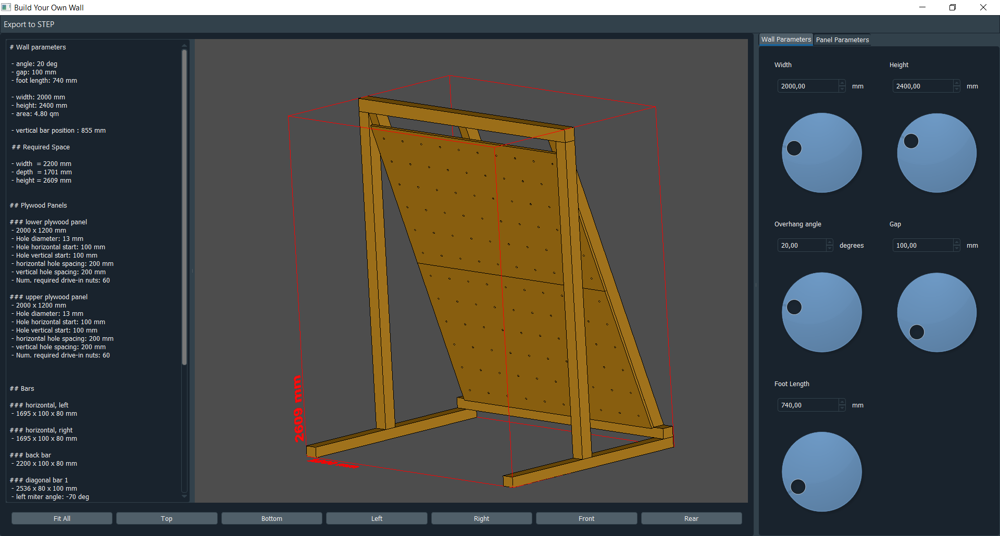

# Build Your Own Freestanding DIY Climbing Wall

## :boom: DISCLAIMER :boom:

I don't know how to build climbing walls or hold a saw. If you build this and hurt yourself, that's on you.



## Installation

Install [Anaconda](https://docs.conda.io/en/latest/miniconda.html) and type

```buildoutcfg
conda install byow -c joergbrech
```

into your anaconda command prompt/shell.

## Usage

Enter
```buildoutcfg
byow
```
into your anaconda command prompt/shell to start the climbing wall configurator. Choose your parameters and build your wall.
For another wall configuration you need to modify the code.

## Development

If you want to modify the code, clone the repository, create a new environment from `environment.yml` and install the development version via pip:

```buildoutcfg
git clone https://github.com/joergbrech/byow.git
cd byow
conda env create -f environment.yml
conda activate climbing-wall
pip install -e .
```

There are not many features: You can use bars, optionally with miterred ends and climbing panels with different hole lattices. You can arrange these parts relatively to each other. There are no convenience functions for this. The current configuration is setup in `byow/climbing_wall.py`. Modify this file to create a different configuration.

## Wouldn't it have been easier to use *any* CAD system directly?

:fu: I was bored, ok?

## Contributing

Give me carpentry advice or write a PR.